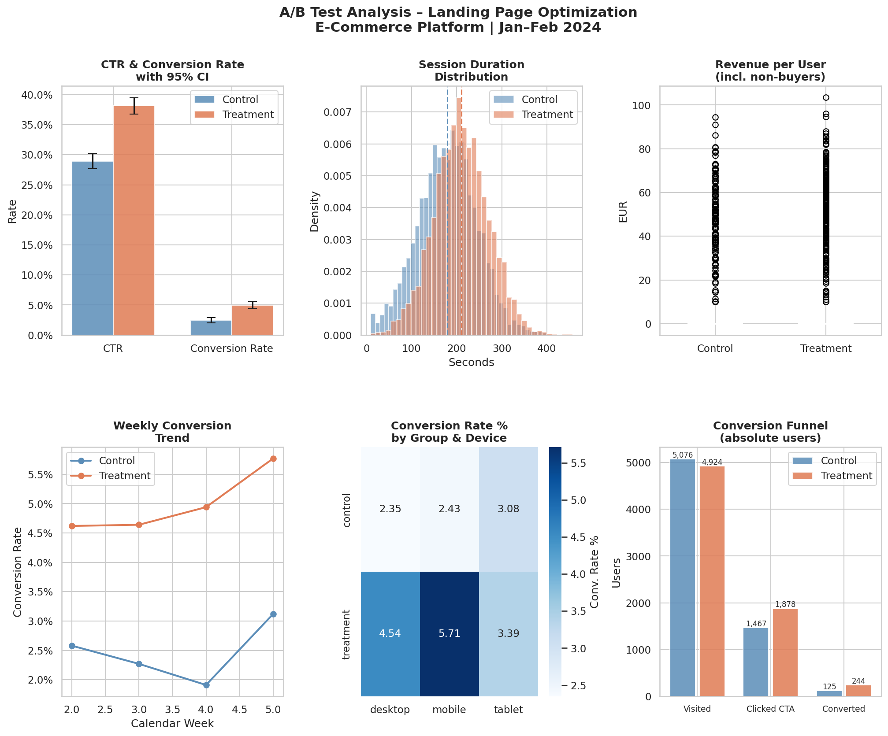

# A/B Test Analysis: Landing Page Optimization
**Tools:** Python · SQL · Power BI | **Domain:** E-Commerce / Digital Media

---

## Project Overview
A full end-to-end A/B test analysis evaluating whether a redesigned landing page improves
click-through rate (CTR), conversion rate and revenue on an e-commerce platform.

**Experiment design:**
- 10,000 users randomly assigned to control (original page) vs. treatment (new page)
- 4-week runtime: January–February 2024
- Primary metrics: CTR, Conversion Rate, Revenue per User

---

## Results Summary

| Metric | Control | Treatment | Lift | p-value |
|--------|---------|-----------|------|---------|
| CTR | 28.9% | 38.1% | **+32.0%** | < 0.001 ✅ |
| Conversion Rate | 2.46% | 4.96% | **+101.6%** | < 0.001 ✅ |
| Revenue / User | €1.19 | €2.60 | **+119.5%** | < 0.001 ✅ |
| Avg Session (sec) | 179s | 210s | **+17.1%** | < 0.001 ✅ |

**Recommendation: Deploy the treatment page.**  
Estimated monthly revenue uplift (50k users): **+€63,791**

---

## Statistical Methods

| Test | Metric | Why |
|------|--------|-----|
| Chi-Square test | CTR, Conversion Rate | Binary outcome (clicked / not clicked) |
| Welch's t-Test | Session Duration | Continuous, unequal variances |
| Mann-Whitney U | Revenue per User | Non-normal distribution (zero-inflated) |
| Wilson CI (95%) | CTR, Conversion Rate | Proportion confidence intervals |

---

## Project Structure

```
ab-test-landing-page/
│
├── ab_test_data.csv              # Simulated dataset (10,000 users)
├── generate_data.py              # Dataset generation script
├── ab_test_analysis.py           # Full Python analysis + visualizations
├── ab_test_queries.sql           # SQL queries (8 analytical queries)
├── ab_test_analysis.png          # Output: 6-panel visualization
│
├── powerbi_weekly_kpis.csv       # Pre-aggregated data for Power BI
├── powerbi_device_segment.csv    # Device segment data for Power BI
└── POWERBI_GUIDE.md              # Step-by-step Power BI dashboard guide
```

---

## Key Visualizations


---

## Segment Findings
- **Mobile users** show lower CTR in both groups → mobile UX optimization recommended as next step
- **Treatment effect is consistent** across all devices and all 4 weeks (no novelty effect)
- **Germany (DE)** drives 70% of traffic and mirrors overall results

---

## How to Run

```bash
# 1. Generate dataset
python generate_data.py

# 2. Run full analysis
python ab_test_analysis.py

# 3. For SQL: load ab_test_data.csv into any SQL client
#    (DBeaver, pgAdmin, SQLite, etc.) and run ab_test_queries.sql

# 4. For Power BI: follow POWERBI_GUIDE.md
```

**Dependencies:** `pandas`, `numpy`, `scipy`, `matplotlib`, `seaborn`

```bash
pip install pandas numpy scipy matplotlib seaborn
```

---

